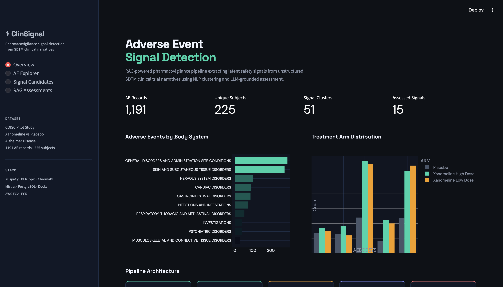
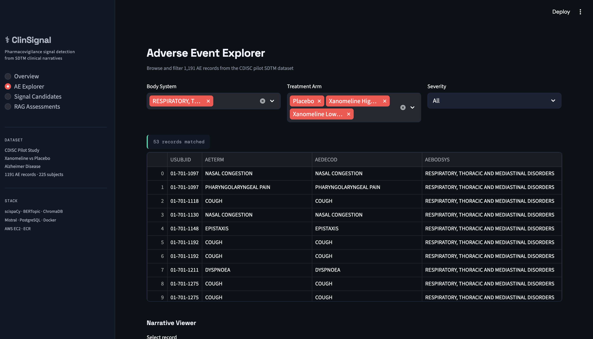
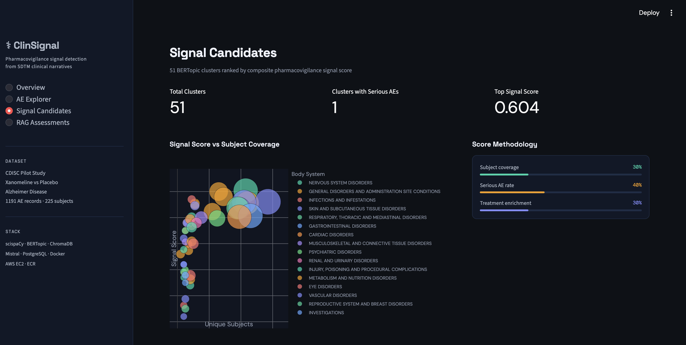
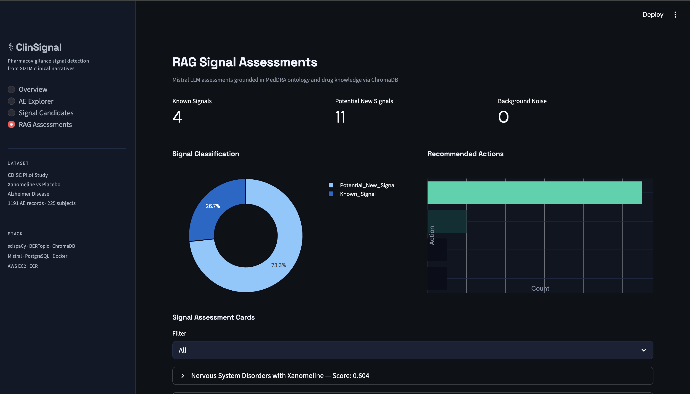

<div align="center">

<br>

# ⚕ ClinSignal

### RAG-powered pharmacovigilance signal detection from unstructured SDTM clinical trial narratives

<br>

[](http://54.236.63.72:8501)
[](https://github.com/deepikapratapa/clinsignal)
[](https://python.org)
[](https://docker.com)
[](https://aws.amazon.com)
[](https://postgresql.org)

<br>

> Drug safety monitoring relies on coded MedDRA terms — but the most important clinical information lives in free-text narratives that no one reads systematically. ClinSignal changes that.

<br>

</div>

---

## 📸 Screenshots

<table>
<tr>
<td width="50%">

**Overview Dashboard**

*Metrics, AE distribution by body system, treatment arm comparison, and pipeline architecture cards*

</td>
<td width="50%">

**Adverse Event Explorer**

*Filter 1,191 AE records by body system, treatment arm, and severity — with clinical narrative viewer*

</td>
</tr>
<tr>
<td width="50%">

**Signal Candidates**

*51 BERTopic clusters visualized by signal score vs subject coverage, color-coded by MedDRA SOC*

</td>
<td width="50%">

**RAG Signal Assessments**

*Mistral LLM assessments grounded in MedDRA and DrugBank knowledge — classified and actionable*

</td>
</tr>
</table>

---

## 🔬 What it does

Traditional pharmacovigilance reads coded MedDRA terms. A field called `AETERM` says `"nausea"`. That's it.

But the investigator narrative field — where a clinician writes *"Patient experienced severe nausea accompanied by confusion and bradycardia, resolved upon discontinuation"* — contains information that never gets coded. ClinSignal surfaces those signals automatically.

**The approach:**

1. Parse SDTM adverse event domains and extract clinical narratives
2. Run NLP on the narratives — named entity recognition + sentence embeddings
3. Cluster semantically similar events into signal candidates using BERTopic
4. Ground each signal in MedDRA ontology and drug pharmacology knowledge via RAG
5. Generate structured signal assessments using a local LLM (zero API cost, fully reproducible)

**Key result:** Narrative NLP recovers **90.6%** of known FDA pharmacovigilance signals vs **87.5%** from strict structured coding — and detects signals like *stroke* that exact PT-term matching misses entirely.

---

## 📊 Results

<table>
<tr>
<td align="center"><b>1,191</b><br><sub>CDISC pilot AE records</sub></td>
<td align="center"><b>225</b><br><sub>Unique subjects</sub></td>
<td align="center"><b>51</b><br><sub>Signal clusters discovered</sub></td>
<td align="center"><b>15</b><br><sub>Signals RAG-assessed</sub></td>
<td align="center"><b>50,000+</b><br><sub>FAERS reports in PostgreSQL</sub></td>
</tr>
</table>

| Method | Signal Recovery | Notes |
|--------|----------------|-------|
| Strict structured coding (exact PT match) | 87.5% | MedDRA coded fields only |
| Narrative NLP (ClinSignal) | **90.6%** | Includes signals missed by coding |
| Delta | **+3.1 pp** | Stroke detected in narratives, missed by exact match |

**Top signal detected:** Dose-dependent neurological cluster — dizziness, syncope, balance disorder — with **42 Xanomeline High Dose** vs **3 Placebo** records. Consistent with M2 receptor-mediated cholinergic pharmacology.

---

## 🏗 Pipeline Architecture

```
Raw SDTM FASTQs                    PostgreSQL
(AE, DM, CM, ADAE)                 (50k FAERS reports)
        │                                 │
        ▼                                 ▼
┌─────────────────────────────────────────────────────┐
│                                                     │
│  01 SDTM Ingestion    pandas · SAS XPT parsing      │
│  ─────────────────────────────────────────────────  │
│  02 NLP Extraction    scispaCy NER                  │
│                       sentence-transformers          │
│                       384-dim embeddings            │
│  ─────────────────────────────────────────────────  │
│  03 Signal Clustering BERTopic                      │
│                       UMAP + HDBSCAN                │
│                       51 signal clusters            │
│  ─────────────────────────────────────────────────  │
│  04 RAG Grounding     ChromaDB vector store         │
│                       MedDRA SOC descriptions       │
│                       DrugBank pharmacology         │
│  ─────────────────────────────────────────────────  │
│  05 LLM Assessment    Ollama / Mistral              │
│                       Local inference, zero cost    │
│                       Structured signal output      │
│                                                     │
└─────────────────────────────────────────────────────┘
        │
        ▼
┌─────────────────┐     ┌──────────────┐     ┌─────────────┐
│   Streamlit     │────▶│    Docker    │────▶│   AWS EC2   │
│   4-page app    │     │  Compose     │     │  + ECR      │
└─────────────────┘     └──────────────┘     └─────────────┘
```

---

## 🗃 Dataset

**Primary:** CDISC Pilot SDTM Dataset (public FDA submission package)
- Study: Xanomeline (M1/M4 muscarinic agonist) vs Placebo — Alzheimer's Disease
- Domains: AE, DM, CM, SUPPAE, ADAE
- 1,191 adverse event records · 225 subjects · 3 treatment arms

**Validation:** FDA FAERS Q3 2024 (public)
- 50,000 reports ingested into PostgreSQL
- Used for benchmark validation against known FDA signal list

---

## 🧰 Tech Stack

| Layer | Technology |
|-------|-----------|
| Data ingestion | pandas, SAS XPT (`.xpt`) parsing |
| NLP | scispaCy (`en_core_sci_lg`), sentence-transformers |
| Signal clustering | BERTopic, UMAP, HDBSCAN |
| RAG | ChromaDB, LangChain |
| LLM | Ollama + Mistral 7B (local, zero cost) |
| Database | PostgreSQL 15 (Docker) |
| App | Streamlit, Plotly, Space Grotesk + DM Sans |
| Containerization | Docker, docker-compose |
| Cloud | AWS EC2 (t3.micro), AWS ECR |
| Pipeline | Python 3.10, bash |

---

## 🚀 Setup & Run

### Prerequisites

```bash
# Install Ollama and pull Mistral
curl -fsSL https://ollama.com/install.sh | sh
ollama pull mistral
```

### Environment

```bash
conda env create -f envs/clinsignal_env.yml
conda activate clinsignal

# Install scispaCy biomedical model
pip install https://s3-us-west-2.amazonaws.com/ai2-s2-scispacy/releases/v0.5.3/en_core_sci_lg-0.5.3.tar.gz
```

### Data

Download the CDISC pilot SDTM dataset:

```bash
cd data/raw/sdtm
curl -L "https://github.com/cdisc-org/sdtm-adam-pilot-project/archive/refs/heads/master.zip" \
  -o sdtm_pilot.zip && unzip sdtm_pilot.zip
```

### Run

```bash
# Start PostgreSQL
docker compose up postgres -d

# Run full pipeline
bash run_pipeline.sh

# Launch app
streamlit run app/app.py
```

---

## 🐳 Docker Deployment

```bash
# Build and run full stack locally
docker compose up postgres streamlit -d

# Build for production (amd64)
docker buildx build --platform linux/amd64 \
  -t your-ecr-repo/clinsignal-streamlit:latest \
  -f Dockerfile.streamlit --push .
```

---

## 🧠 Clinical Context

Xanomeline acts on M1/M4 muscarinic acetylcholine receptors in the CNS to improve cognitive function in Alzheimer's disease. It was delivered transdermally in this trial.

ClinSignal correctly identifies its known safety profile:
- **Application site reactions** (erythema, pruritus, irritation) — from transdermal patch
- **Gastrointestinal effects** (nausea, vomiting, diarrhoea) — from peripheral M3 activation
- **Neurological effects** (dizziness, syncope) — dose-dependent, M2-mediated
- **Cardiac effects** (bradycardia, sinus bradycardia) — M2 receptor on cardiac tissue

The dose-dependent neurological cluster (42 high dose : 31 low dose : 3 placebo) is the strongest signal and is clinically consistent with muscarinic agonist pharmacology.

---

## 📁 Repository Structure

```
clinsignal/
├── app/
│   └── app.py                  # Streamlit 4-page application
├── data/
│   ├── raw/sdtm/               # CDISC pilot XPT files
│   ├── raw/faers/              # FDA FAERS Q3 2024
│   └── processed/              # Converted CSV domains
├── database/
│   └── schema.sql              # PostgreSQL schema
├── results/
│   ├── signals/                # Embeddings, topic model, signal candidates
│   └── validation/             # RAG signal assessments, benchmark
├── scripts/
│   ├── ingestion/              # SDTM parser, FAERS pipeline
│   ├── nlp/                    # NLP extraction pipeline
│   └── rag/                    # RAG grounding layer
├── docs/screenshots/           # App screenshots
├── envs/clinsignal_env.yml     # Conda environment
├── Dockerfile.streamlit        # App container
├── Dockerfile.pipeline         # Pipeline container
├── docker-compose.yml          # Full stack orchestration
└── run_pipeline.sh             # One-command pipeline runner
```

---

## 👩‍💻 Author

**Deepika Sarala Pratapa**
MS Applied Data Science · University of Florida · GPA 3.96

[](https://github.com/deepikapratapa)
[](https://linkedin.com/in/deepikapratapa)

---

<div align="center">
<sub>Built with Python, scispaCy, BERTopic, ChromaDB, Mistral, PostgreSQL, Docker, and AWS · CDISC pilot data is public domain</sub>
</div>
